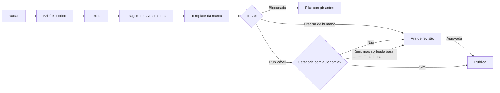

# Motor de campanhas com IA e autonomia governada

> **Configuração atual:** perfil de educação financeira para jovens que ainda não sabem investir, com o nome provisório "Começando a Investir" (troque em `marca.json`). O catálogo de ofertas está desligado e a categoria "Como funcionam os investimentos" é sempre revisada por uma pessoa. O funcionamento descrito abaixo vale para qualquer marca: onde o texto fala em banco, leia "perfil".

MVP de um motor que percebe a necessidade de um post, define público e objetivo, escreve os textos, gera a imagem com IA, monta a arte no template da marca, passa a peça pelas travas de governança e então publica no Instagram ou manda para revisão humana.

A autonomia é conquistada por categoria. Toda categoria começa com aprovação humana em todas as peças. A publicação automática só pode ser liberada quando os dados mostram que as travas e os revisores humanos concordam, e ela volta sozinha para humano se essa concordância cair.

**Premissa do piloto:** Instagram orgânico, em conta de teste, com publicação em modo simulação por padrão.

## Como funciona



1. **Radar.** Escolhe o tema a partir do calendário, dos objetivos do banco, das ofertas ativas, do histórico de peças e de uma orientação opcional da equipe.
2. **Brief e público.** Define objetivo, segmento, insight, mensagem-chave, chamada para ação, métrica de sucesso e a cena da imagem. Só oferece segmentos permitidos para a categoria.
3. **Textos.** Título, subtítulo, chamada da arte, legenda e hashtags, dentro dos limites da política e sem números financeiros inventados.
4. **Imagem.** A IA de imagem gera apenas a cena, sem texto, marcas, dinheiro ou pessoas públicas.
5. **Arte.** O template aplica textos, cores, fontes, logo e avisos legais do catálogo. Nada disso passa pela IA de imagem. Saída em JPEG 1080 × 1350 (4:5).
6. **Travas.** Regras em código e um revisor de IA com visão, que olha o fundo gerado e a arte final, decidem entre três vereditos.
7. **Decisão.** A peça publica sozinha só quando o veredito é publicável, a categoria tem autonomia liberada, o sistema não está pausado e a peça não foi sorteada para auditoria. Caso contrário, vai para a fila.

Cada etapa, decisão e intervenção humana fica na trilha de auditoria da peça, com autor, horário e versão da política.

## Início rápido

Requisitos: Node.js 20 ou superior (testado no 22).

```bash
npm install
cp .env.example .env    # preencha as chaves
npm run teste           # pipeline completo com IA simulada: sem chaves e sem custo
npm start               # painel em http://localhost:3000
```

O teste offline roda 18 cenários: pipeline completo, cada tipo de trava, aprovação, edição humana, nova imagem, escada de autonomia, limites diários e pausa. Ele também grava uma prévia da arte em `teste-saida/previa-arte.jpg`, com fundo sintético.

**Painel sem chaves, para demonstração de layout:**

```bash
npm run teste -- --manter                          # mostra a pasta temporária no final
DADOS_DIR=/caminho/mostrado PORT=3001 npm start
```

O painel abre com as peças do teste. Os fundos são sintéticos e o botão de gerar pede as chaves.

## O painel

- **Fila de revisão.** Peças aguardando decisão, com a arte, o motivo do post, o público, os textos editáveis, a legenda como será publicada, as travas e as notas do revisor de IA.
- **Ações.** Aprovar e publicar, salvar textos e reavaliar, gerar nova imagem com uma direção, reprovar com motivo. Uma peça bloqueada não pode ser aprovada: é preciso corrigir, e toda alteração passa pelas travas de novo.
- **Todas as peças.** Histórico com filtro por situação.
- **Autonomia.** Evidência por categoria (revisões e concordância com a meta), liberação e revogação, e a configuração ativa.
- **Pausar tudo.** Botão de emergência no topo. Enquanto estiver pausado, nada é publicado, nem com aprovação humana, e a agenda não gera peças. O motivo fica na auditoria.

O campo "Seu nome" identifica quem aprovou, editou ou liberou cada coisa.

## Configurar para um banco

Toda a configuração editorial fica em nos arquivos .json. A política de exemplo é uma referência inicial: termos, avisos legais e limites precisam ser validados pelo jurídico e pelo compliance do banco antes do piloto.

| Arquivo | Conteúdo |
| --- | --- |
| `marca.json` | Nome, descrição, tom de voz, valores, objetivos de negócio, cores, fontes, logo, estilos visuais e restrições visuais para o prompt de imagem. Sem logo configurado, o template usa o nome da marca. |
| `politica.json` | Categorias com risco e autonomia máxima, termos proibidos, concorrentes, vícios de texto de IA, limites, notas mínimas do revisor, severidade das checagens visuais, parâmetros de autonomia e rótulo de IA. A versão da política fica registrada em cada peça. |
| `calendario.json` | Datas que o radar considera: fixas, n-ésimo dia da semana do mês ou períodos, e a janela de antecedência. |
| `segmentos.json` | Segmentos editoriais. Os marcados como vulneráveis nunca recebem oferta de crédito. |
| `ofertas.json` | Catálogo oficial: produto, destaque, texto legal, validade e se está ativa. Taxas e números financeiros só entram na peça por aqui. |

**Dados pendentes.** Qualquer campo com `[DADO A SER VALIDADO]` gera alerta em simulação e bloqueia a publicação real. Os campos `observacao` são instruções e ficam fora dessa checagem.

**Fontes.** As fontes Poppins em `` são de licença aberta (OFL). Para usar a fonte do banco, coloque os arquivos junto dos demais e ajuste os nomes em `marca.json`.

## Travas de governança

Toda peça recebe um de três vereditos:

- **Bloqueada:** não sai sem correção, nem com aprovação humana.
- **Precisa de revisão humana:** há alertas que pedem o olhar de uma pessoa.
- **Publicável sem humano:** nenhum apontamento. Só sai sozinha se a categoria tiver autonomia liberada.

**Regras em código**, sobre textos, público e oferta:

| Regra | Severidade |
| --- | --- |
| Categoria prevista na política | Bloqueio |
| Textos obrigatórios preenchidos | Bloqueio |
| Tamanhos dentro do limite | Alerta |
| Sem termos proibidos | Bloqueio |
| Sem taxas, valores ou rendimentos escritos pela IA | Bloqueio |
| Sem citar bancos, corretoras ou marcas | Bloqueio |
| Sem vícios de texto gerado por IA | Alerta |
| Segmento permitido para a categoria | Bloqueio |
| Oferta vinculada ao catálogo oficial | Bloqueio |
| Avisos legais obrigatórios presentes | Bloqueio |
| Sem dados pendentes de validação | Alerta em simulação, bloqueio em publicação real |
| Arte legível | Alerta |

**Revisor de IA com visão.** Ele confere o fundo gerado nos itens abaixo. As severidades vêm de `politica.json`.

| Item no fundo gerado | Severidade |
| --- | --- |
| Texto, letras ou números | Bloqueio |
| Logotipo ou marca de terceiros | Bloqueio |
| Cédulas, moedas ou cartão com números | Bloqueio |
| Pessoa com rosto, mãos ou corpo deformados | Bloqueio |
| Conteúdo sensível ou ofensivo | Bloqueio |
| Pessoa pública reconhecível | Bloqueio |
| Criança identificável | Alerta |

O revisor também dá notas de 0 a 10 para aderência ao brief, tom de voz, clareza, qualidade visual e legibilidade. Estes casos geram alerta:

- nota média abaixo de 8;
- qualquer nota abaixo de 6;
- risco reputacional acima de baixo;
- o revisor indicar que editaria a peça antes de publicar.

No momento do envio, as regras em código rodam de novo com o modo de publicação atual.

## Escada de autonomia

1. Toda categoria começa em aprovação humana.
2. A liberação é uma decisão humana, na aba Autonomia. Ela só é aceita com pelo menos 20 peças revisadas em que as travas deram "publicável" e com concordância de 90% ou mais. Concordância é a parte dessas peças que o humano aprovou sem editar. O servidor recusa a liberação sem essa evidência, mesmo por chamada direta à API.
3. Depois da liberação, 10% das peças continuam indo para conferência humana por sorteio.
4. Se a concordância cair abaixo da meta, a categoria volta sozinha para aprovação humana.
5. Ofertas de crédito e de investimento são sempre humanas: a política não permite modo automático nessas categorias.

Também há limites diários: 6 gerações e 3 publicações, ajustáveis em `politica.json`.

**Para demonstração:** é possível reduzir `autonomia.min_amostras` numa cópia da política para mostrar a escada em poucas peças. Não use esse ajuste no piloto.

## Supabase (opcional)

Por padrão, peças, auditoria e imagens ficam em arquivos na pasta `dados/`. Para usar o Supabase:

1. Crie o projeto e rode `schema.sql` no SQL Editor. O script pode rodar de novo sem perder dados.
2. No `.env`, preencha `ARMAZENAMENTO=supabase`, `SUPABASE_URL` e `SUPABASE_SERVICE_ROLE_KEY`.

O schema cria quatro tabelas: peças, auditoria, modo das categorias e controle de pausa. O RLS fica ligado e sem políticas, então a chave pública não acessa nada. O servidor usa a chave service_role, que ignora o RLS e só pode ficar no servidor.

O bucket `pecas` é público porque o Instagram baixa a arte pela URL, e os nomes dos arquivos começam com o UUID da peça.

## Publicação real no Instagram

O modo padrão é simulação: o sistema registra o que publicaria e não envia nada. Para publicar de verdade, use uma conta de teste.

1. Use uma conta profissional do Instagram e crie um app no painel de desenvolvedores da Meta.
2. Escolha o tipo de login:
   - **Login do Instagram.** Host `graph.instagram.com`, permissões `instagram_business_basic` e `instagram_business_content_publish`.
   - **Login do Facebook.** Host `graph.facebook.com`, permissões `instagram_basic`, `instagram_content_publish` e `pages_read_engagement`. A conta fica ligada a uma Página. Se a Página exigir autorização de publicação (PPA), ela precisa estar concluída.
3. Gere um token de longa duração. Anote a data de renovação, porque o token expira.
4. No `.env`, preencha `PUBLICACAO_MODO=real`, `IG_USER_ID`, `IG_ACCESS_TOKEN` e `META_GRAPH_HOST`.
5. A imagem precisa estar num endereço público em https no momento da publicação. Use o Supabase ou, com armazenamento local, defina `PUBLIC_BASE_URL` com o endereço https do servidor.

A API permite até 100 posts publicados a cada 24 horas por conta. Em modo real, o painel mostra "Publicação real no Instagram" e pede uma confirmação extra antes de aprovar.

## Deploy

```bash
docker build -t motor-campanhas .
docker run -d -p 3000:3000 --env-file .env -v motor-dados:/app/dados motor-campanhas
```

- **Uma instância só.** A trava de geração e a agenda ficam em memória.
- **Por que container e não função serverless.** A estimativa é de 1 a 2 minutos por peça entre IA, imagem e revisão, mais do que o limite de tempo comum dessas funções. Um container também roda na nuvem do banco sem mudanças.
- **Agenda.** A agenda automática (`CRON_RADAR`) roda no fuso de `FUSO_HORARIO`. O padrão é dias úteis às 10h.
- **Checagem de saúde.** Em `/saude`.

## Segurança

- Chaves só no `.env` do servidor. O `.env` está no `.gitignore`.
- Defina `PAINEL_USUARIO` e `PAINEL_SENHA` antes de expor o painel. Use HTTPS na frente do servidor, porque Basic Auth não criptografa a senha. Para o banco, o caminho é o SSO corporativo.
- `/midia` é público, porque o Instagram precisa baixar a arte, e os nomes de arquivo são UUIDs.
- O motor não usa dado de cliente. A segmentação aqui é editorial, porque post orgânico chega a todos os seguidores. A segmentação por perfil de cliente fica para mídia paga e CRM, dentro do ambiente do banco.

## Custos

Custo por peça: [DADO A SER VALIDADO].

Cada peça faz quatro chamadas ao Claude (radar, brief, textos e revisor com duas imagens) e uma geração de imagem. "Gerar nova imagem" refaz a imagem, a arte e a revisão. "Salvar textos" refaz a arte e a revisão. Meça no piloto pelo painel de uso de cada provedor.

## Situação e próximos passos

**Validado:**
- O pipeline, as travas, a escada de autonomia, os limites e a pausa passam no teste offline com IA, imagem e publicação simuladas.
- O painel foi testado em navegador, em tela de computador e de celular.
- `schema.sql` teve a sintaxe validada com o analisador do Postgres.

**Ainda não executado:**
- As integrações foram escritas conforme a documentação atual de cada API, mas ainda não rodaram com chaves reais: Claude, OpenAI, Google, Instagram e Supabase. O primeiro passo do piloto é rodar uma peça de cada provedor em conta de teste.
- O Dockerfile ainda não teve o build testado.

**Próximos passos:**
- Mídia paga pela Meta Marketing API, onde a segmentação por público de fato acontece.
- Integração com o CRM do banco, sem que dado de cliente saia do ambiente dele.
- Monitor de comentários com pausa automática em caso de crise.
- Métricas de desempenho dos posts alimentando o radar.
- SSO corporativo no lugar do Basic Auth.
- Provedor de imagem com licença comercial ampla, como Adobe Firefly, pela mesma interface de `gerador.js`.
- Carrossel, stories e outros canais.

## Documentação das APIs

- Claude: https://docs.claude.com
- Instagram, publicação de conteúdo: https://developers.facebook.com/docs/instagram-platform/content-publishing
- OpenAI, geração de imagem: https://platform.openai.com/docs/guides/image-generation
- Gemini, geração de imagem: https://ai.google.dev/gemini-api/docs/image-generation
